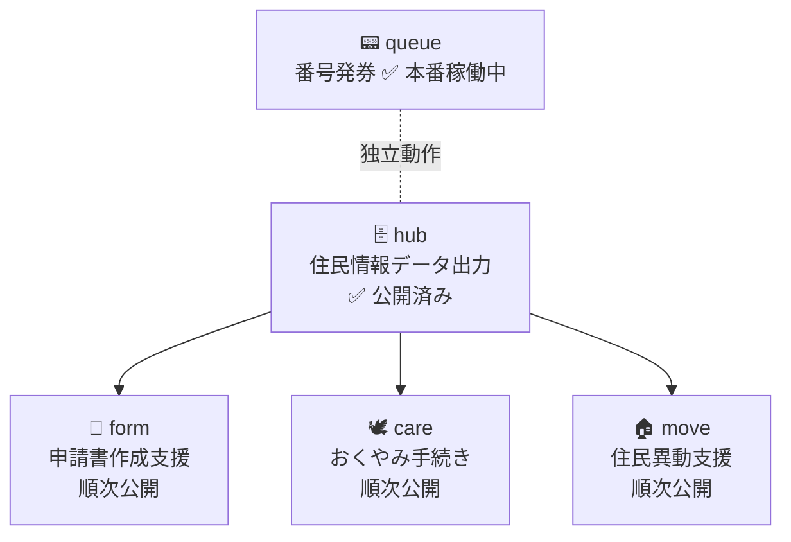

# MADO — Memuro Agile Desk Open

> An open-source counter service system built by and for small Japanese municipalities.

> 窓口に来た住民が、名前を55回書く。
> その問題を、現場の職員が自分で作って解決した。

北海道芽室町が開発・運用している行政窓口業務支援システム **MADO** のOSS版。
中・大規模向けSaaSではなく、**小規模自治体が現場で使い続けられるLITE版**として設計している。

> 📦 **このリポジトリは MADO プロジェクト全体の入口（umbrella）です。**
> コードはありません。設計方針・議論・導入一覧を置いています。
>
> | リポジトリ | 役割 | 状態 |
> |---|---|---|
> | **[MADO](https://github.com/Memuro-Town/MADO)**（ここ） | なぜ作ったか・方針・議論 | — |
> | **[MADO-queue](https://github.com/Memuro-Town/MADO-queue)** | 番号発券（個人情報なし） | ✅ 公開・本番稼働 |
> | **[MADO-packages](https://github.com/Memuro-Town/MADO-packages)** | hub / form / care / move | ✅ hub 公開済み（form 以降は順次） |
>
> 動かすなら、用途に応じて [MADO-queue](https://github.com/Memuro-Town/MADO-queue) か [MADO-packages](https://github.com/Memuro-Town/MADO-packages) へ。

---

## パッケージ構成

| パッケージ | 説明 | リポジトリ | 状態 |
|---|---|---|---|
| **queue** | 番号発券システム | [MADO-queue](https://github.com/Memuro-Town/MADO-queue) | ✅ 本番稼働中 |
| **hub** | 住民情報データ出力 | [MADO-packages](https://github.com/Memuro-Town/MADO-packages) | ✅ 公開済み（本番稼働中） |
| **form** | 申請書作成支援 | 同上（`packages/form`） | 順次公開 |
| **care** | おくやみ手続き | 同上（`packages/care`） | 順次公開 |
| **move** | 住民異動支援 | 同上（`packages/move`） | 順次公開 |

`queue` は受付ネットワーク上で独立して動作する。庁内システムとのネットワーク接続は不要で、住民の個人情報を扱わない設計になっている。
`hub` / `form` / `care` / `move` は閉じた庁内ネットワーク向けで、[MADO-packages](https://github.com/Memuro-Town/MADO-packages) にまとめている。現在は `hub` のみ公開。`form` 以降は整備が済み次第、同じリポジトリに追加する。

---

## なぜ作ったか

### 住民が名前を55回書く問題

転入・婚姻と国保、障害者手帳などの手続きが重なると、住民は同じ書類に何度も同じ情報を書き込む。
MADOは住民情報を一度読み込み、各申請書に自動転記することでこの負担を解消する（`form` パッケージ）。
`queue` はその窓口体験の入口として、来庁者の受付・番号発券・呼び出しを担う。

### 現場の職員が自分で作った

専門的なプログラミング知識のない窓口職員がAIを活用して開発した（Vibe Coding）。
基礎自治体の現場が開発した業務システムを、自治体公式OSSとして公開する。

### 芽室町の規模（参考）

同規模の自治体が導入を検討する際の目安として。

| 指標 | 数値 |
|---|---|
| 人口 | 17,454名（2026年3月31日現在） |
| 1日あたり来庁者数 | 163件（総合案内が設置された東側入口での計測） |
| 戸籍・住民票等発行件数 | 20,769枚（2025年実績） |
| 住民票異動件数 | 2,506件（2025年実績） |

---

## これは何か

| | MADO | 中・大規模向けSaaS |
|---|---|---|
| ターゲット | 小規模自治体（人口〜5万人程度） | 中・大規模自治体 |
| 導入コスト | ソフトウェアは無償（構築支援は別途） | 月額・初期費用あり |
| カスタマイズ | コードで自由に改変可 | ベンダー依存 |
| 設計思想 | 来庁者の不安解消・対話時間の確保 | 処理効率化 |

アナログとデジタルを組み合わせた設計。「速く処理する」より、システム導入により生まれる余力を「丁寧に寄り添う」窓口応対に充てることを優先している。

> ソフトウェア自体は無償だが、環境構築・DB設計・DB更新などが必要なため、構築支援の委託を想定している。

---

## MADOの方針

MADOには「採用するかどうか」を判断するための一貫した基準がある。
機能提案・改善提案を検討する際は、つねにこの方針に立ち返る。

### 1. 判断基準は「芽室町の窓口でフィットするか」

MADOは北海道芽室町の窓口という具体的な現場から生まれた。
ある機能・変更を採用するかどうかは、**芽室町の窓口（現状のフロー、および見直し後のフロー）で実際に使えるか**を基本的な判断軸とする。

小規模自治体向けのLITE版であり、デジタルで完結させることを目的にしていない。
職員ナビゲーションや電子署名など、SaaSが持つような高度なデジタルフォローは目指さない。
アナログとの併用でシステムがシンプルになり、窓口業務が成立するなら、それを正解とする。

### 2. 将来の備えは採用する

現在の窓口では使っていない機能であっても、**将来的な課題への対策として必要**と判断すれば採用を検討する。
「今すぐ使うか」だけでなく「現場が将来直面しうるか」も判断材料とする。

### 3. 巨大な汎用システムは目指さない

他自治体での利用を意識してはいるが、**あらゆる自治体に対応する汎用システムを作るものではない**。
汎用性を追求すると際限なくシステムが肥大化し、改修コストと運用コストが増大して、結果的に全体の損失につながる。

MADOの考え方は逆である。**芽室町の現場でフィットするものが、同じ規模の他自治体でも使えるもののベースになる** ——
この発想で、まず本町に必要なものを軸に据える。

各自治体の固有仕様は**フォークで対応**してほしい。固有のアレンジを本体に取り込み続けると、保守が困難になるためである（フォークの方針は [CONTRIBUTING.md](https://github.com/Memuro-Town/.github/blob/main/CONTRIBUTING.md) を参照）。

### 4. 方向性は現場が決め、コミュニティと議論する

MADOのメンテナーは**非エンジニアの現場職員**である。
方向性は Issue での議論を通じてメンテナーが決定し、採用するものについては PR をお願いする形をとる。

メンテナーは内容を正しく理解するまで質問を重ねることがある。
AIを使えば「それらしい回答」を素早く返すことはできるが、**コントリビューターの提案に敬意を示すため、メンテナー側のAIの利用は最小限にとどめ**、提案者との対話と質問によって判断する。

時間がかかることもあるが、現場が理解して決めることを大切にしたい。

---

## 3者の価値創造

| 主体 | 得られるもの |
|---|---|
| **芽室町** | 開発・維持コストを外部と分散できる。担当者が異動してもコミュニティが保守を支えるため、属人化を解消できる |
| **参画自治体** | 開発コストを抑えて現場で使えるシステムを導入できる。ただし芽室町での実運用実績はあるが、コード品質は保証されていない |
| **エンジニア・ベンダー** | 普段触れない行政ドメイン知識が得られ、本番稼働中の行政システムへ貢献できる。MITライセンスのため商用利用可。自治体への構築支援を通じた新規顧客獲得にも活用できる |

---

## 現在の状況と求めること

MADOは「解決したい課題は明確だが、技術力がない」という現場の職員がAIを活用して開発した（Vibe Coding）。窓口業務での実用には耐えているが、コードの品質・設計・テストの面では未成熟な部分が多い。

**現場が作ったプロダクトを、エンジニアコミュニティと一緒に育てたい。** 特に以下の点で力を借りたい：

- コードレビュー・リファクタリング
- DB設計の見直し（場当たり的な実装で、将来の拡張性が考慮できていない）
- テスト設計・自動化
- セキュリティ観点での確認
- 他自治体が導入しやすくなるための設計改善

行政ドメインの現場知識はこちらにある。技術的な知識を持つ人と組み合わさることで、より多くの自治体で使えるシステムになると考えている。

---

## Contributing

バグ報告・ドキュメント修正・設計議論、どこからでも歓迎する。各自治体の固有仕様はフォークで自由に派生してよい。**まず各パッケージのリポジトリの Issue で話しかけてほしい。**

- 貢献ガイド: [CONTRIBUTING.md](https://github.com/Memuro-Town/.github/blob/main/CONTRIBUTING.md)
- 行動規範: [CODE_OF_CONDUCT.md](https://github.com/Memuro-Town/.github/blob/main/CODE_OF_CONDUCT.md)
- 脆弱性の報告: [SECURITY.md](https://github.com/Memuro-Town/.github/blob/main/SECURITY.md)

---

## 導入自治体

→ [FORKED_SITES.md](FORKED_SITES.md)

---

## License

MIT License — Copyright (c) Memuro Town

詳細は [LICENSE](LICENSE) を参照。

本リポジトリのコードは参考実装であり、各自治体での法令適合性・業務適合性は導入主体が確認すること。
